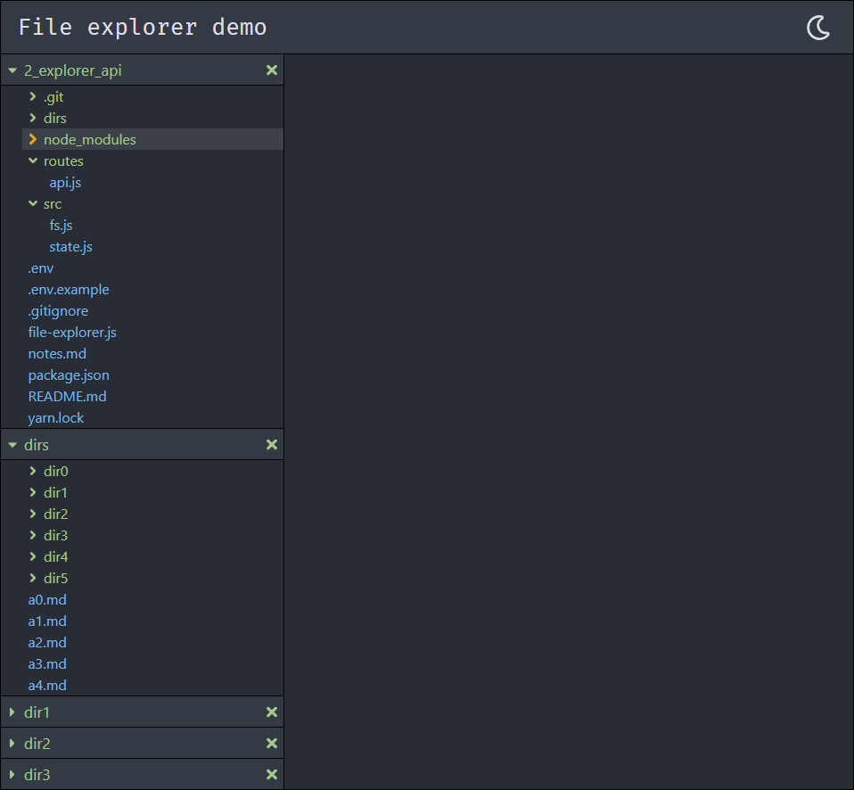
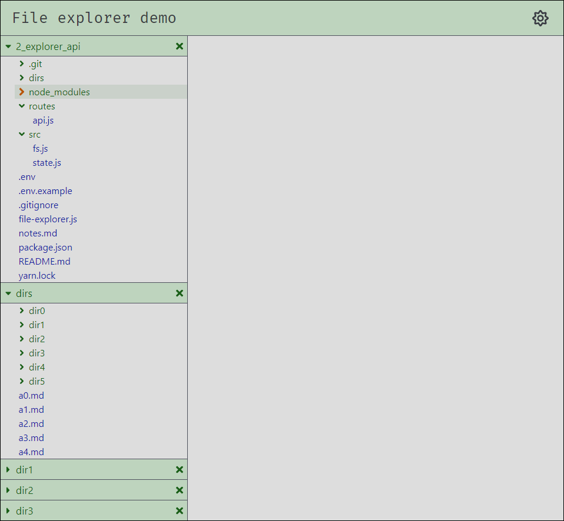

# File explorer

- [About](#about)
- [Installation](#installation)
- [Overview](#overview)

- [Implementation and choices](#implementation-and-choices)
- [Notes](#notes)
- [Things to improve](#things-to-improve)
- [Issues](#issues)
- [Dependencies](#dependencies)
- [Development dependencies](#development-dependencies)

---

## About

This repository contains a a **file explorer** component built with [React](https://reactjs.org/) and [Sass](https://github.com/sass/dart-sass). It renders a set of directory trees served by a backend API, and is updated on file changes through a WebSocket connection.

---

## Installation

Clone the repository with [git](https://git-scm.com/):

```shell
git clone git@github.com:ycandau/explorer.git
```

Change directory to the root of the repository:

```shell
cd explorer
```

Install all the dependencies with [yarn](https://classic.yarnpkg.com/en/):

```shell
yarn install
```

Setup the local environment variables in the `.env` file:

```shell
PORT=3000
REACT_APP_WEBSOCKET_URL=ws://localhost:8000
```

Run the app in development mode. Open [http://localhost:3000](http://localhost:3000) to view it in the browser.

```shell
yarn start
```

The app needs the backend API found [here](https://github.com/ycandau/explorer_api). Start the backend server before starting the app.

---

## Overview

Here is the component embedded in a page, in dark mode:



And in light mode:



The dark and light themes are controlled from a toggle and implemented using CSS variables and data attribute selectors.

Folders and non folders are colored differently to make it easier to distinguish them.

A folder can be expanded and collapsed by clicking anywhere on the corresponding highlighted line.

A little extra feedback is provided to the user with a CSS color and scale transition on the caret icon, when the cursor hovers over the line.

The whole tree can also be closed by clicking on the cross situated at the right of the root folder.

---

## Implementation

I used React's functional components since it is the recommended approach in the latest versions of the framework.

To manage the app state I considered three alternatives:

- Multiple `useState()` hooks.
- A single `useReducer()` hook with a reducer function.
- A dedicated state container library like [Redux](https://redux.js.org/).

I adopted the second option as I find that it is much easier to write modular code with a reducer, but the state wasn't complex enough to justify using a library such as Redux.

To keep the code modular I use a number of custom hooks to:

- Manage the application state.
- Fetch initial data from the server once after the first render.
- Establish the WebSocket connection with the server.
- Update the server when folders are expanded or collapsed.
- Update the server when trees are closed.

The component seems to run smoothly even with large folders such as `node_modules`. As discussed in the README for the server, only data on expanded folders is exchanged to avoid a brute force recursion through the full folder structure. The component also takes advantage of information on the tree structure encoded in the arrays by the server.

Some of the user actions are well suited for optimistic rendering. When collapsing a folder or closing a tree we can update the local state before sending the asynchronous request to the server. On the other hand, expanding a folder does require waiting for the response from the server.

I considered providing visual feedback to indicate the status of the asynchronous requests (loading and such...). But due to the short delays I decided against it as a brief flicker might be more distracting than helpful.

---

## Things to do

- Resizable sections
- A way to add trees from the file explorer
- Filtering by glob or regex patterns
- File type icons
- Custom scroll bars

---

## Dependencies

- [React](https://reactjs.org/): A JavaScript library for building user interfaces.
- [axios](https://github.com/axios/axios): Promise based HTTP client for the browser and Node.js.
- [react-fontawesome](https://github.com/FortAwesome/react-fontawesome): Font Awesome 5 React components using SVG with JS.

---

## Development dependencies

- [Sass](https://github.com/sass/dart-sass): CSS extension language.
